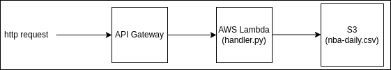

# Example of using `serverless framework` with Python

This simple project demonstrates how you can use [serverless framework](https://www.serverless.com/) to run a simple python function in AWS Lambda.

The function downloads the scores of the NBA games from yesterday and saves them to s3 bucket.

## How it works

Creating lambda function in AWS from scratch is a little bit tedious. Fortunately there is a `serverless framework` software which facilitates it.

We use `serverless` in a node container (since it is easier to install `serverless` with `npm`). In the same container we install `Python`, in which we write a function that we want to be executed in AWA lambda.

Additionally we install `serverless-python-requirements` plugin, which enables us to automatically upload python packages (requirements) to lambda environment. Our project requires a python package, which communicates with REST API published by nba.com. 

Right after the start of the container, a simple init script creates a role in AWS (uses credentials provided in docker volume), which has the permission to execute lambda functions and also access s3, where the scores of nba games are saved.

You'll find `serverless`'s config in `serverless.yml` file. You might notice the `http` section, which creates an Amazon API Gateway instance, which enables you to trigger the lambda function via URL, which you will find near the end of the `docker-compose` logs, starting with `app_1  | endpoint: GET -`.

## Triggering and viewing results

The are 3 simple ways to trigger the execution of our lambda function:

- using API Gateway and url provided

- using AWS Management Console -> API Gateway, where in the `Test` section you can trigger the function

- using AWS Management Console -> Lambda, where in the `Test` section you can trigger the function

The easiest way to view the results is to go to AWS Management Console -> S3 -> your nba bucket. The file with the game scores should be there.


## Architecture




## Pre-requisites

- AWS account and Access Key ID and Secret Key stored in `~/.aws/credentials`

- s3 bucket with a name of your choice, e.g. `nba-daily-scores-<account_name>`


## Setup

1. make sure you store your AWS access key in `~/.aws/credentials`. You may also want to set 

```
[default]
region = eu-central-1
output = json
```

in `~/.aws/config`.

2. `docker-compose up --build` will:

    - create a nodejs-based docker container

    - install all relevant dependencies, including python and serverless framework

    - deploy this example python application to lambda. You'll be able to trigger the application by sending a GET request (using either curl or your browser) to the address provided at the end of the logs from docker-compose. The endpoint is set up by serverless at Amazon API Gateway.

## Resources

The code is based on this article: [https://www.freecodecamp.org/news/how-to-deploy-aws-lambda-with-serverless/](https://www.freecodecamp.org/news/how-to-deploy-aws-lambda-with-serverless/).

This piece of documentation helps to understand how to deal with python dependencies in your code: [https://www.serverless.com/plugins/serverless-python-requirements](https://www.serverless.com/plugins/serverless-python-requirements).
